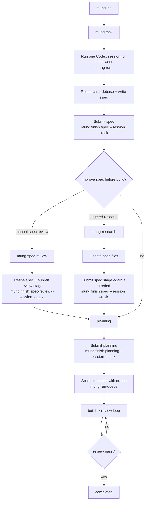

# mung

`mung` is a Rust CLI for running structured multi-stage agent workflows in a repo.

It manages:
- agent stages (`code` and `writer`)
- task state (`.agents/<agent>/tasks/.../task.json`)
- session lifecycle (`.agents/<agent>/sessions/.../session.json`)
- queue/backlog behavior
- issue tracking for the `code` agent

## Requirements

- Rust toolchain (to build from source)
- `codex` CLI and/or `claude` CLI installed
- Git repo for normal usage (`mung init` warns if no `.git`)

Important defaults:
- Default agent: `code`
- Running `mung` with no command is the same as `mung start`
- `code` workflow stages default to `codex` unless you explicitly override with model flags/env

## Install

### Build from source

```bash
cargo build --release
```

Binary path:
- `target/release/mung`

### Install globally

```bash
cargo run -- install
# or: ./target/release/mung install
```

This installs:
- `~/.local/bin/mung`
- prompts under `~/.mung/code/` and `~/.mung/writer/`
- slash-command symlinks under:
  - `~/.claude/commands/`
  - `~/.codex/prompts/`

If `~/.local/bin` is not in `PATH`, add:

```bash
export PATH="$HOME/.local/bin:$PATH"
```

### Uninstall

```bash
mung uninstall
```

This removes:
- `~/.local/bin/mung`
- linked mung prompt files in `~/.claude/commands` and `~/.codex/prompts`
- `~/.mung/`

## Quick Start

### Code agent (default)

```bash
cd /path/to/repo
mung init
mung start
```

Typical flow:
1. `start` runs `spec -> planning`
2. for `code`, `start` stops at `build` handoff
3. continue with `mung run <task>` or `mung run-queue`

### Writer agent

```bash
cd /path/to/repo
mung --agent writer init
mung --agent writer start
```

Writer stages are: `init -> plan -> write -> edit -> completed`.

## Agent Workflows

### Code stages

- `spec`
- `spec-review`
- `spec-review-issues`
- `planning`
- `build`
- `review`
- `completed`

Default next-stage mapping:
- `spec -> planning`
- `spec-review -> planning`
- `spec-review-issues -> planning`
- `planning -> build`
- `build -> review`
- `review -> completed`

Queue-processing stages (`run-queue` / `run-next`):
- `spec-review-issues`, `build`, `review`

### Coding flow diagram (`code` agent, single-Codex style)



Operational notes:
- this style keeps one primary Codex instance active for spec/planning work.
- “submit spec” in practice is `mung finish spec ...` (or `finish spec-review ...` after manual review).
- `mung research` helps improve spec quality before moving into queue execution.
- `run-queue` then drives iterative `build -> review` until completion.

### Writer stages

- `init`
- `plan`
- `write`
- `edit`
- `completed`

Default next-stage mapping:
- `init -> plan`
- `plan -> write`
- `write -> edit`
- `edit -> completed`

Queue-processing stages:
- `write`, `edit`

## Core Commands

Global usage:

```bash
mung [--agent <code|writer>] [--model <claude|codex>] [--force-model] <command>
```

### Setup and lifecycle

- `mung install`
- `mung uninstall`
- `mung init [path]`
- `mung start`

### Task and queue management

- `mung task <name> [--hold] [--description <text>]`
- `mung hold <name>`
- `mung activate <name>`
- `mung queue [task]` (alias: `q`)
- `mung plan <task>` (show parsed plan/checklist steps)
- `mung delete <name> [--force]` (alias: `dequeue`)
- `mung reorder <name> <position>` (build-stage only)
- `mung set-stage <name> <stage> [--status <status>]`

### Execution

- `mung run <name>`
- `mung run-next [name]` (alias: `rn`)
- `mung run-queue [--loop <n>]` (alias: `rq`)
- `mung finish [stage] [--next <stage>] [--session <id>] [--task <task>]`

### Review, research, debug

- `mung review <task> [focus]`
- `mung spec-review <task>`
- `mung research <task> [focus]` (`code` agent only)
- `mung debug [--file <path> | --stdin | <bug...>]` (uses `codex`)
- `mung how [topic]`

### Issues (`code` agent only)

- `mung issues [--task <task> | --unassigned] [--status <open|resolved|all>] [--priority <P0..P3>] [--type <spec|build|bug|test|perf|other>] [--source <review|debug|submit|manual>]`
- `mung issue list ...` (same filters)
- `mung issue add --title <title> [--task <task>] [--priority ...] [--type ...] [--source ...] [--file <path>] [--stage <stage>] [--body <text> | --stdin-body]`
- `mung issue resolve <id> [--resolution <text>]`
- `mung issue assign <id> --task <task> [--stage <stage>]`
- `mung issue show <id>`

## How to Use

This section is the practical operator workflow.

### 1) One-time machine setup

```bash
# from this repo
cargo build --release
./target/release/mung install
```

Check install:

```bash
mung --version
mung --help
```

### 2) One-time repo setup

Code repo:

```bash
cd /path/to/your/repo
mung init
```

Writer repo:

```bash
cd /path/to/your/writing/repo
mung --agent writer init
```

### 3) Create and inspect tasks

Create a normal task:

```bash
mung task add-login-rate-limit --description "Protect login endpoint from abuse"
```

Create backlog/held task:

```bash
mung task migrate-settings-schema --hold --description "Schema migration after Q2 launch"
```

Inspect all tasks:

```bash
mung queue
```

Inspect one task (if it exists as task dir but not tracked yet, this also tracks it):

```bash
mung queue add-login-rate-limit
```

### 4) Run a single code task end-to-end

Use this when focusing on one task:

```bash
mung run add-login-rate-limit
```

What happens:
1. task is claimed (lock created)
2. current stage prompt is rendered and model CLI is started
3. stage advances only when `mung finish ...` is called
4. loop continues until task reaches `completed`, interruption, or failure

Manual `finish` examples for code:

```bash
# default stage progression
mung finish spec --session <session-id> --task add-login-rate-limit
mung finish planning --session <session-id> --task add-login-rate-limit
mung finish build --session <session-id> --task add-login-rate-limit

# review stage: explicit branch
mung finish review --session <session-id> --task add-login-rate-limit --next build
mung finish review --session <session-id> --task add-login-rate-limit --next spec-review-issues

# review pass
mung finish review --session <session-id> --task add-login-rate-limit
```

### 5) Run many tasks from queue

Run exactly one eligible task-stage and return:

```bash
mung run-next
```

Run a specific task for one stage:

```bash
mung run-next add-login-rate-limit
```

Run queue continuously:

```bash
mung run-queue
```

Tune review/build bounce protection:

```bash
mung run-queue --loop 8
```

Queue control:

```bash
mung hold migrate-settings-schema
mung activate migrate-settings-schema
mung reorder add-login-rate-limit 1
mung delete old-experiment --force
```

### 6) Use issue workflow (code agent)

Create issue:

```bash
mung issue add \
  --title "Race condition in token refresh" \
  --task add-login-rate-limit \
  --type bug \
  --priority P1 \
  --source manual \
  --body "Observed concurrent refresh requests creating duplicate writes."
```

List open issues:

```bash
mung issues --task add-login-rate-limit
```

Resolve issue:

```bash
mung issue resolve <issue-id> --resolution "Added per-user lock and idempotency key."
```

Assign unassigned issue to task and target stage:

```bash
mung issue assign <issue-id> --task add-login-rate-limit --stage build
```

### 7) Review/spec-review/research/debug workflows

Focused manual review run:

```bash
mung review add-login-rate-limit "Focus on auth middleware and cache invalidation"
```

Spec review run:

```bash
mung spec-review add-login-rate-limit
```

Research run (no direct state mutation by command itself):

```bash
mung research add-login-rate-limit "Compare current approach with existing session architecture"
```

Debug run:

```bash
mung debug "Login endpoint returns 500 after refresh token rotation"
# or
mung debug --file crash.log
# or
cat crash.log | mung debug --stdin
```

### 8) Writer workflow (practical)

Create and run:

```bash
mung --agent writer task handbook-v1 --description "Internal engineering handbook"
mung --agent writer run handbook-v1
```

Writer stage transitions are explicit:

```bash
mung --agent writer finish init --session <session-id> --task handbook-v1
mung --agent writer finish plan --session <session-id> --task handbook-v1
mung --agent writer finish write --session <session-id> --task handbook-v1
mung --agent writer finish edit --session <session-id> --task handbook-v1
```

Important:
- for writer, always pass stage to `finish` (`task` is not a valid writer finish stage)

### 9) Recovery and manual correction

If interrupted (`Ctrl+C`), resume:

```bash
mung run add-login-rate-limit
```

If stage/status drifted and you need manual correction:

```bash
mung set-stage add-login-rate-limit build --status pending
```

If multiple sessions exist and `finish` cannot resolve one uniquely, pass session explicitly:

```bash
mung finish build --session <session-id> --task add-login-rate-limit
```

### Command behavior notes

- `mung finish`:
  - default stage is `task` (works for `code`; `writer` should pass an explicit stage)
  - resolves session from `--session`, then `METAGENT_SESSION`, then a unique running session
- `mung review <task> [focus]` runs a one-shot manual review stage (no auto-`finish` instruction)
- `mung spec-review <task>` runs the spec-review stage once
- `mung queue <task>` adds an existing task directory into tracked queue state if `task.json` is missing
- `mung task <name>` creates a task; if task already exists it prints current state/history and can update `--description`

## End-to-End Code Workflow

### 1. Initialize repo

```bash
mung init
```

Creates `.agents/code/` with templates and state folders. On first init, it may run bootstrap if placeholders are still present.

### 2. Create/enter tasks

Interactive route:

```bash
mung start
```

Manual route:

```bash
mung task my-feature
mung run my-feature
```

Task name rules:
- lowercase letters, digits, `-`
- max length 100
- no leading `.` or `..`

### 3. Advance stages with `finish`

The model process is expected to call `mung finish ...` for each stage.

Examples:

```bash
# default transition for a review session
mung finish review --session <session-id> --task my-feature

# explicit next stage (review found issues)
mung finish review --session <session-id> --task my-feature --next build

# send back to spec-review-issues
mung finish review --session <session-id> --task my-feature --next spec-review-issues
```

Notes:
- `--session` can be omitted only when there is exactly one running session (or `METAGENT_SESSION` is set).
- If a task has open issues, finishing to `completed` is automatically redirected to `build`.

### 4. Run one task vs whole queue

```bash
mung run my-feature        # keep running this task until completion/interruption
mung run-next              # run one eligible stage once
mung run-queue             # process eligible tasks until queue is empty
```

`run-queue` behavior:
- skips held tasks
- claims tasks via lock files to avoid collisions
- for `code`, enforces a review/build loop limit (default 4, `--loop 0` means 100)

### 5. Use issue tracking when blocked

```bash
mung issue add --title "Fix flaky test" --task my-feature --type test --priority P1
mung issues --task my-feature
mung issue resolve <issue-id> --resolution "Stabilized retry logic"
```

Open issues set task status to `issues` and affect stage progression until resolved.

## Writer Workflow

Typical loop:

```bash
mung --agent writer init
mung --agent writer task my-book
mung --agent writer run my-book
```

Writer has no issue subsystem. Queue stages are `write` and `edit`.

## State and File Layout

### Global (user home)

```text
~/.local/bin/mung
~/.mung/
  code/
  writer/
~/.claude/commands/
~/.codex/prompts/
```

### Per repo

```text
.agents/
  code/
    AGENTS.md
    SPEC.md
    TECHNICAL_STANDARDS.md
    tasks/<task>/
      spec/
      plan.md
      task.json
    sessions/<session-id>/session.json
    claims/<task>.lock
    issues/<issue-id>.md
  writer/
    AGENTS.md
    tasks/<task>/
      content/
      outline/
      style/
      research/
      editorial_plan.md
      task.json
    sessions/<session-id>/session.json
    claims/<task>.lock
```

Task status values:
- `pending`
- `running`
- `incomplete`
- `failed`
- `completed`
- `issues`

## Model Selection

Global options/env:
- `--model <claude|codex>` or `METAGENT_MODEL`
- `--force-model` or `METAGENT_FORCE_MODEL=1|true|yes`

Selection logic summary:
1. if task has open issues, `codex` is forced unless explicit model + force-model are both set
2. otherwise explicit model wins
3. otherwise agent stage defaults apply (`code` stages default to `codex`)

Other useful env vars:
- `METAGENT_AGENT` (default agent)
- `METAGENT_REPO_ROOT` (override repo root detection)
- `METAGENT_SESSION` and `METAGENT_TASK` (used by `finish` and model subprocesses)
- `METAGENT_CODESIGN_ID`, `METAGENT_SKIP_CODESIGN` (macOS install/signing)

## Development

### Build

```bash
cargo build
cargo build --release
```

### Test

Use `cargo nextest`:

```bash
cargo nextest run
```

Optional macOS build helper:

```bash
tools/build.sh
```

## Troubleshooting

- `No repo found (missing .agents/ or .git)`:
  - run inside a git repo, or run `mung init` first, or set `METAGENT_REPO_ROOT`.
- `Task '<name>' is already claimed`:
  - another `run`/`run-queue` is active for that task.
- `METAGENT_SESSION not set and no unique active session found`:
  - pass `--session <id>` explicitly to `finish`.
- `Issue tracking is only supported for the code agent`:
  - run issue commands with `--agent code`.
